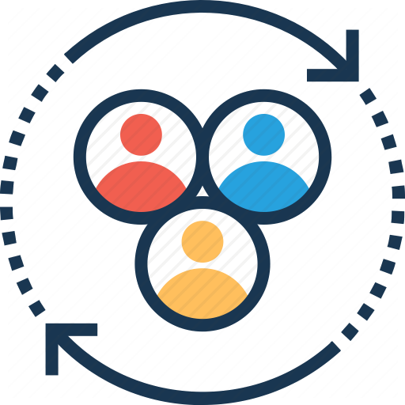

# edraj

### The next-generation Information Management System

 

Version 0.3 Amman, January - 2018 kefah.issa@gmail.com

---
# The challenge

###	_Is it really possible or even feasible for one app/service to handle most of the user content and communication management needs (private/shared/public) as opposed to the currently hugely scattered Social media outlets and user managed content options? and what are the key qualities for that Next-gen app to succeed?_

---
### Current Status-quo  

A wide range of use-cases served by independent and greatly over-lapping applications each attempting to lock-in the user's data.
- **Social Media apps**: Facebook, Instagram, Twitter
- **Public CMS, Blogs, News Syndication** : Word-press, RSS/Atom
- **Selective-sharable Content/Media store**: e.g. Cloud drives
- **Messaging and Email**
- **_Future_**: Knowledge base (e.g. wiki), note-taking, todos and ticketing
- **_Future_**: Sheets, Inventory: e.g. Excel, Access, Foxpro

---
### Aspiration 

One unified set of open-standards that enable all those use-cases (is able to handle various types of content) and run in a federated fashion. Offering superior content-management experience and eliminating vendor-lock-in that is overwhelming the users.

Email (SMPT/IMAP4/POP3) comes as an example of open-standard used by the "Email" use-case.

---
### Barriers  

* Technically speaking there is no reason why one application (with a proper ecosystem) cannot serve all those use-cases and more. At the end of the day it boils down to information/data entities that should be maintained, indexed and shared / published. 
* Unfortunately and despite the fact that there have been several attempts to address sub-sets of use-cases, none of them tries to address the problem in its fully generality. 
Let alone offering it at competitive quality and speed.
* The other major barrier is the user's affinity to the existing social network offerings.

---
### Crossing the chasm 

Significant advantages must be offered for the users to switch:

1. **Unified data and meta-data**: All data/content is well-defined and managed using the same verbs. (e.g. REST, schema.org/JSON-LD)
2. **Federated/self-hosted and Standard-API-based**: Inter-operable independently-hosted domains (DHT?) (sets of users). Also key-based idM (e.g. OpenId connect).
	* True account/content ownership
3. **Web-enabled/SEO-friendly availability of content**: Just think how quickly the user-contributed content gets buried and almost unreachable to others.
4. **Smart**: Programmable time/trigger-based activities. e.g. IFTTT
5. **Free/Open-source**: Grant users the right to use, modify and evolve the implementations. 

+++
### Crossing the chasm (continued) 

6- **Performance and Quality**: The app **must** be very performing and not less stable than the current offerings.

7- **Privacy and Security** 

8- **Easy service and data redundancy options**

+++
### Unified data and meta-data 

* File-based content and meta-data persistence. The content and its meta-data file live in the file-system under certain relative path.
* Content is well-defined and self-described (through meta-data) 
* The Meta-data for each content include: 
  * Name
  * Content guid
  * Owner guid
  * Access-control settings (permissions): for Actors, Groups and Work-groups.
  * Time-stamps: Created at, Last-updated
  * Change-history for revision-enabled content
  * Labels: Tags, Categories 
  * Path? (redundant from the file-system)
  * Schema reference definition (for structured data)

+++
### Content Management Basics  

* Every entity in the system has a life-long globally unique identifier (guid): Actor, Work-group, Content, ...etc.
* Basic verbs:
  * Create
  * Update content 
  * Update meta-data (Access-control/permission included)
  * Delete
* Every thing is persisted on the file-system including messages. (implementation recommendation). 
* The caching/index component should always be able to completely rebuild the cache/indexes as such it should only be considered for performance purposes.
* Future: both in-motion and in-transit data should be encrypted

+++
### Federated and Standard-API-based 

- A Domain is a collection of independently hosted set of users. With the various edraj components (see Components section). 
- Federation enables users and groups / communities to self-host and inter-operate with everyone else. 
- Federation and Standard-API are key to free users from vendor-lock-in. It even allows multiple-technical implementations.
- Federation is also a means to eliminate the concept of one single service-provider, helping distribute the processing load to a manageable level as opposed to requiring huge investment in infrastructure. 
- Federation additionally and specifically addresses one major aspect : The cost. As it eliminates the need / requirement for one central service provider; it will simply distribute the cost of hosting (computing/storage/data-transfer) over the federated domain. 

+++
### Federated and Standard-API-based (continued) 

Federation and the option of self-hosted inter-operable information management system empowered the users and communities to **finally** and **truly** own their content. 
  - No Tracking
  - No Advertisement
  - No one can delete their files (posts/videos ...)
  - No one can suspend their account
  - The user no longer needs to beg YouTube, Facebook and twitter not to action against them.
  - Yes, there is a financial element associated with self-hosting; but its a small-price to pay that would set you free.

+++
### Performance and Quality 

Imagine how poorly would an app be received if it lacks either of those two qualities. No matter how great its idea is, how nice-looking, how easy, ...etc. As such those two qualities are very key and are actually make-or-break. 
---

### Key concepts and definitions  

* **Actor**: Individual agent / user.
* **Work-group**: Collaboration of a group of actors on workgroup-owned content (like FB pages/groups)
* **Content**: Media, Document, Text + self-describing Meta data.
	* **Labels**: Tags (user-defined, free-form) and Categories (pre-defined, hierarchical)
	* **Container**: Hierarchical aggregation of content: folder/tar-ball
	* **Permission**: Privileges granted to owner and people
* **Action**: Manage content, React to content, subscribe to notifications (filter-based actor/tag/category/type),
* **Notification**: Event notifications for subscribed users.
* **Page**: A single page view made of **Blocks** (physical viewable manfistication of the content).

+++
### Actor 

User/profile (single-user): 
- Information about the user that includes:
  - Bio
  - Key pair(s) 
  - Email(s) 
  - Phone (contact)
  - Groups of Actors (like access-groups in Facebook) to help simply access-control management
  - Guids/Public-keys/API-url-pointers of other associated users (contacts, followed, friends, ...etc)

+++
### Work-group  

- Team-centeric collaborative content. 
- Members are from any domain

+++
### Content 
- Admin (Meta/privileges)
- Create/update/delete,
- Manage comments

* Labels are used to qualify the content for better search and organization.
* Content is also organized in arbitrary folder-structures, like regular file-systems and cloud-drives. 

+++
### Action 

* Manage content: Create/Update/Delete, Set meta-data options (including permissions)
* React: comment, share, like/dislike ...etc.
* Message / Communicate
* Subscribe to notification based on a filter. 

+++
### Notification 

Notification-streams (follow/unfollow person or workgroup or specific-content, tag)
A user can follow notifications (get stream of notifications) based on filter-rules:

- Actor Activities
- Work-group Activities
- Tags / Categories (Horizontally trending general public content) twitter-hashtag like (What's trending) 
- Specific types of notifications
- The ranking formula is also affected by positive reactions (likes + rating), shares, comments and people who reacted.

+++
### Page / Block 

A page is a public presentation of selected content / streams. (blog-sphere like)
 
* Users can choose layout/template and how content is presented by setting queries. with pagination support.
* The layout groups a number of blocks
* Each block has a query-filter to determine the content to be surfaced and a template to determine how it is presented.

---

##	_For every respective set of use-cases  edraj can be reduced to an existing known / popular platform: Blog, Email, Messaging, Social media, News services._

---
### Main components 

* **Identity Manager (idM)**: Manage Actors/users and people groups.
* **Content Manager**: Create/Manage, React, and publish (permission / access control)
* **Notifications and Messaging**: Action-driven notification system and messaging capability.
	* **_Future_: Peer-to-peer**: Audio/Video conferencing 
* **Miner**: Index and attempt to improve meta-data. also remote-index (gopher-like)
* **Add-ons**: local and remote repo of usable add-ons (mini-apps)
* **Public interface**: Public content including permissions, pages and blocks + notification subscription/distribution (syndication).
* **Schema definitions**: structured data: standard + custom: Local + remote repos
* **Client-apps**: Mobile, Desktop, Web-SPA

+++
### Identity Manager (idM)  

* Setup per domain, hosting an arbitrary number of users as determined by the admin
* The identity manager also stores the public keys (and links to them) of users on other domains (followed / friends).
* Think OpenID connect (OAuth2) compliant. 

+++
### Content Manager 

- Persistence of data / content with the proper Meta-data 
- Types of content:
  - Plain text
  - Rich text
  - Structured data (person json schema)
  - Message
  - Wiki
  - Binary-payload: Payload of Media files, Documents or any other type of binary attachment (supports both embedded and URL-pointers ).
- Types of container:
  - Folder (regular file-system folder)
  - Tar-ball (compressed hierarchical folder/file structure).

+++
### Miner  

- Index and classification of local data that enriches local meta data
- Indexing of public content from other domains (public and permitted content)
- Polling other domains for notifications (a client may only be notified when a domain has something new, then it should poll for it).
- Public mining-only services could exist that would horizontally aggregate and promote relevant trending content.

+++
### Add-ons 
- Plugins/Mini-apps
- Public repositories (one formal)

+++
### Public interface 

- Serves public web-enabled content: Pages + blocks, including generating proper robots.txt+sitemaps: for SEO
- Serves public API for 
	* Notification-polling and subscription
  * Content Query and retrieval
  * Surface Content management component public api's
  * Messaging and communication
  * Structured content query (schema-enabled content in a machine-consumable form)

+++
### Schema definitions 
Pre-defined schema definitions allow machine consumption of properly described structured data.
The local + remote repos that contain the schema definitions for structured data.

Think:
- Task/Todo-entry
- Contact details: Person or Organization
- Scheduled Event: Public/private event, meeting, reminder ...
- Place + tracking
- Blog/Post/Short-post(tweet-like)
- Term / phrase definition or translation
- Quote / Proverb
- Biography

Each one of these data types is best represented by its own standard schema definition.

+++
### Client-apps 
- Mobile apps: Progressive Android/iOS ..etc.
- Web/Desktop apps: Progressive Web/Desktop apps and/or Native apps.

---
### High-level Architecture diagram

---

### Roadmap and milestones 

* **Kick-off**: June/17 (part-time)
* **Phase I. Conception** : December/17
* **Phase II. Prototype** : June/18
* **Phase III. MVP first release**  : December/18
* **Phase IV. Continuous releasing and improvement**
